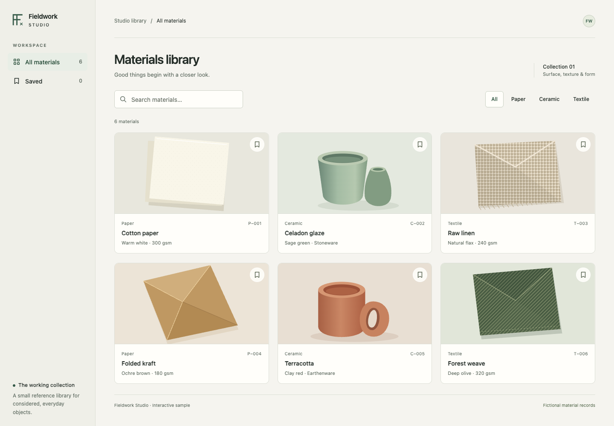

# Harness

A shared working environment for **Codex Desktop** and **Claude Desktop Code**.
Give your agents reusable skills, consistent instructions and practical ways to
check their work, while keeping each project's conventions in charge.

**[Adoption guide](docs/adoption.md)** · [Setup reference](setup/README.md) ·
[Skill catalog](docs/catalog.md) · [Contributing](CONTRIBUTING.md)

The workflow is **make → render or exercise → inspect → repair**. It covers UI,
animation, illustration, office documents, Markdown and software engineering.
The harness began as a personal setup and is available to fork, adapt and use
with your own projects. Installation uses Python's standard library; optional
tools supply browsers, document renderers and other runtimes when you need them.



*The included [Fieldwork Studio example](examples/craft-lab/) has working search,
filters, saved items, keyboard-operable previews and original SVG illustrations.*

## How it fits together

| Layer | What it provides | Where it lives |
| --- | --- | --- |
| Shared foundation | 14 global workflows for engineering, design, research, planning and review | This checkout, installed into your selected clients |
| Project selection | A small foundation plus the specialists your project needs | Your project's `.ai/project.json`, lock and skill directories |
| Verification tools | Installation checks, runtime diagnostics and artifact checks | The `ai.py` CLI and optional local tools |

Start with one client and one project. Add specialists when the work calls for
them. A skill supplies instructions and supporting resources; it does not supply
an account, install a dependency or guarantee an agent will follow it. Verify a
real task in your client after setup.

## What you get

| Capability | Concrete output |
| --- | --- |
| UI and motion | Browser journeys, desktop/mobile screenshots and normal/reduced-motion frames |
| Vector assets | Editable SVG, multi-size light/dark renders and a contact sheet |
| Office documents | Editable DOCX/PPTX/XLSX, page renders and formula recalculation |
| Markdown | Local link, heading and fence checks, plus technical/editorial review workflows |
| Engineering and QA | Project-specific behavior tests, failure investigation and independent artifact review |
| Shared setup | 14 global skills, project skill selection, MCP definitions and native target settings |

The installer needs only Python's standard library. Artifact tools use optional,
already-installed runtimes. Neither installation nor a passing check guarantees
visual quality; inspect the actual result. See [research and design decisions](docs/research/decisions-2026-10-09.md).

The [23 capability contracts](docs/capabilities.md) cover engineering, brand/web/mobile
design, assets/motion, SEO/research, QA, product/business decisions, data, systems,
infrastructure, scaffolding and optimization. Each names a lead workflow, expected
deliverable, failure probe and prerequisites. These are inspectable requirements,
not an expertise rating. Specialists stay project-selected; the global set remains small.

```sh
python3 ai.py capabilities list
python3 ai.py capabilities show backend-engineering
python3 ai.py capabilities check
```

`show` identifies project IDs to register through `project add`, then `project sync`
and `project doctor`. `check` verifies local source coverage and hashes for both
targets; it does not test client activation or runtime behavior. See the
[assurance review](docs/reviews/capability-assurance-2026-10-09.md) for exercised
results and remaining gaps, and [feedback controls](skills/ai-system-evaluation/references/feedback-controls.md)
for how a discovered defect becomes a repeatable check.

## Quick start

You need Git, Python **3.9+**, and at least one supported client installed and signed
in. Keep the clone in a stable location: links and the installed catalog helpers
depend on it, including when skill files use copy mode.
For a guided walkthrough, a rehearsal that leaves your home configuration alone,
and adoption into an existing repository, start with the [adoption guide](docs/adoption.md).

```sh
git clone https://github.com/codemirket/harness.git
cd harness

# Preview the exact changes first. Choose one client or use --target all.
python3 ai.py install --target codex-desktop --dry-run

# Close the selected client before applying changed settings.
python3 ai.py install --target codex-desktop
python3 ai.py check --target codex-desktop
```

For Claude, substitute `--target claude-desktop`. `--target all` installs both.
On Windows, use `py -3` in place of `python3`. The installer supports managed
copies as well as links; add `--mode copy` consistently to install/check to keep
copies. See [setup and recovery](setup/README.md).

After installation, reopen the client and start a fresh session. Confirm that
shared instructions and `skill-catalog` are available, inspect MCP status, and
exercise a representative skill. `check` verifies files and configuration;
it cannot establish that a running client has loaded them.

### What installation changes

| Target | Guidance | Skills | Configuration |
| --- | --- | --- | --- |
| Codex Desktop / CLI | `~/.codex/AGENTS.md` | `~/.agents/skills/` | `~/.codex/config.toml` |
| Claude Desktop Code / CLI | `~/.claude/CLAUDE.md` | `~/.claude/skills/` | `~/.claude/settings.json`, `~/.claude.json` for MCP |

The defaults include OpenAI's documentation MCP server and selected native
permission settings. Review [target defaults](registry/targets.json),
[MCP definitions](registry/mcp.json) and [shared instructions](instructions/AGENTS.md)
before applying them. Unrelated configuration is preserved; conflicting unmanaged
files stop installation. Changed configuration receives a local backup.

Installation does not install clients or packages, log into accounts, start MCP
servers, register a schedule, change projects or enable every skill in the catalog.
Optional model, appearance and plugin preferences are a separate command and
contain the maintainer's choices; they are not universal defaults.

**Claude Chat and Cowork:** local Code configuration does not configure those
surfaces. Use the manual [account handoff](docs/targets.md) for supported skill
uploads; local shell tools and account connections do not transfer automatically.
Zed is not an installation target.

## Add capabilities to a project

Run these commands from the harness checkout, with the absolute path to your
project. Inspect that project's instructions and current Git changes first.

```sh
python3 ai.py project init --project /absolute/project --target all
python3 ai.py project plan --project /absolute/project
python3 ai.py project sync --project /absolute/project
python3 ai.py project doctor --project /absolute/project
```

Use `init` only when the project has no manifest; for an existing registration,
start with `plan`. Replace `all` with your chosen client if you use only one.
Init adds the
small `project-foundation`; add records selections; sync installs verified
payloads; doctor checks them. Existing manifests retain their selections.
Codex project skills go under `.agents/skills`, Claude skills under `.claude/skills`.
Modified and unselected copies are preserved rather than silently deleted.

For example, when a project needs editable vector artwork:

```sh
python3 ai.py project add --project /absolute/project --skill svg-creation --dry-run
python3 ai.py project add --project /absolute/project --skill svg-creation
python3 ai.py project sync --project /absolute/project
python3 ai.py project doctor --project /absolute/project
```

Browse the [skill catalog](docs/catalog.md) and [target selection guide](docs/project-targets.md).
Some optional skills are fetched from pinned upstream sources and require network
access. Review their dependencies and licenses before selecting them.

## Run the workbench

Start by discovering which tools are available:

```sh
python3 ai.py workbench doctor
```

| Operation | Optional prerequisites |
| --- | --- |
| Browser scenarios | Node.js, Playwright and a compatible Chromium browser |
| Vector rendering | Node.js, sharp and Python |
| Office inspection | Python standard library |
| Office rendering | LibreOffice, Poppler (`pdfinfo`, `pdftoppm`) |
| Office demo authoring | python-docx, python-pptx and openpyxl, plus renderers |
| Markdown checks | Python standard library |

Configure existing executable and module paths with `workbench configure`; they
stay in `~/.agent-harness/toolchain.json`, outside the repository. Nothing is
downloaded automatically. The [workbench guide](docs/workbench.md) documents exact
configuration, environment overrides, scenario schema and evidence limits.

To try the included UI, run this in one terminal:

```sh
python3 -m http.server 4173 --bind 127.0.0.1 --directory examples/craft-lab
```

Open `http://127.0.0.1:4173`. With the optional tools configured, run in another
terminal from the same checkout:

```sh
mkdir -p build
python3 ai.py workbench browser --scenario examples/craft-lab/scenario.json --output build/browser-review
python3 ai.py workbench vector examples/craft-lab/fieldwork.svg --output build/vector-review
python3 ai.py workbench documents demo --output build/office-demo
python3 ai.py workbench markdown README.md --output build/readme-review
```

Use a new output directory each time; existing artifacts are never overwritten.
On Windows create `build` with `New-Item -ItemType Directory -Force build`.
Open the generated PNGs and editable originals, inspect the reports, and fix
observed problems. Stop the local server when finished. Generated artifacts are
ignored by Git. Raster image generation uses an available host tool or your
separately connected provider; this repository does not supply an image model.

## Optional Codex plugin

The same source can be packaged as a single `personal-workbench` plugin:

```sh
mkdir -p build
python3 ai.py export --bundle personal-workbench --output build/personal-marketplace
codex plugin marketplace add ./build/personal-marketplace
```

Use the supported desktop plugin interface to install and verify it. This bundle
contains the global workflows, SVG/motion skills, executable helpers and examples.
Avoid enabling duplicate plugin and direct-install copies of the same skills.
Plugin packaging does not install global instruction files, provision runtimes or
make quality checks automatic. See [plugin setup and updates](docs/plugins.md).

## Customize and update

| File or directory | Purpose |
| --- | --- |
| [instructions/AGENTS.md](instructions/AGENTS.md) | Shared working principles |
| [skills/](skills/) | Capability instructions, references and helpers |
| [registry/harness.json](registry/harness.json) | Global selections, project defaults and plugin bundles |
| [registry/targets.json](registry/targets.json) | Client destinations and native settings |
| [registry/mcp.json](registry/mcp.json) | Shared MCP definitions |
| [registry/catalog.json](registry/catalog.json) | Reviewed project skills, profiles and source pins |

Fork this repository to maintain your own choices. Keep credentials, personal
configurations and generated reports outside Git. Review upstream changes before
pulling: linked skills and catalog helpers immediately use the changed checkout.
For managed skill copies, rerun installation; for project skills, run plan, sync and doctor.
There is no automatic update schedule by default.

If installation reports a conflict, preserve the existing content and review the
proposed change. Do not delete files to force a pass. Recovery, backup behavior
and isolated-home rehearsals are documented in [setup](setup/README.md#ownership-and-recovery).
There is no general uninstall command; remove only confirmed harness-owned links
or files and restore the relevant configuration backup after reviewing it.

## Development and verification

```sh
python3 scripts/render_registry.py --check
python3 -m unittest discover -s tests
sh -n setup/macos.sh
git diff --check
```

Run the shell syntax check on a POSIX shell. Browser/vector integration tests need
their optional runtimes and explicitly skip when unavailable. A recorded
macOS run passed **552 tests** with no skips; see the [verification record](docs/research/verification-2026-10-09.md)
for scope and limits. Windows client installation is supported, but the recorded
artifact-rendering evidence is from macOS, not a Windows runtime certification.

For changes, keep target adapters separate from shared capabilities, add behavior
checks for consequential changes, update affected documentation and preserve
upstream attribution. Never make a failing check pass by weakening it.
See [Contributing](CONTRIBUTING.md) for the repository map, isolated checks and
what to include with a proposed change.

## Find your next step

| I want to… | Read |
| --- | --- |
| Adopt the harness or introduce it to a team | [Adoption guide](docs/adoption.md) |
| Understand installation, conflicts and recovery | [Setup reference](setup/README.md) |
| Choose skills for a task | [Capability contracts](docs/capabilities.md) and [catalog](docs/catalog.md) |
| Use different skills for Codex and Claude | [Project targets](docs/project-targets.md) |
| Render and inspect an artifact | [Workbench guide](docs/workbench.md) |
| Package skills as a plugin | [Plugin guide](docs/plugins.md) |
| Review provenance and redistribution terms | [Source review](docs/source-review.md) and [notices](docs/third-party-notices.md) |

### Existing clones

This repository moved from `nazmirket/.ai` to `codemirket/harness`. Update your
remote from inside your existing clone:

```sh
git remote set-url origin https://github.com/codemirket/harness.git
```

The checkout can keep its existing directory name. Keeping it in place preserves
source-backed skill links. Review and pull updates using the [adoption guide](docs/adoption.md).

## License

Original harness code, documentation and examples are available under the
[MIT License](LICENSE). Third-party and adapted material retains its own terms;
see [third-party notices](docs/third-party-notices.md), per-file attribution and the
[source review](docs/source-review.md). Catalog entries do not relicense upstream
skills, models, services or optional tools.

Historical Windmill skill sources retained in Git history remain under AGPLv3,
as documented in the third-party notices; they are not part of the current install.
